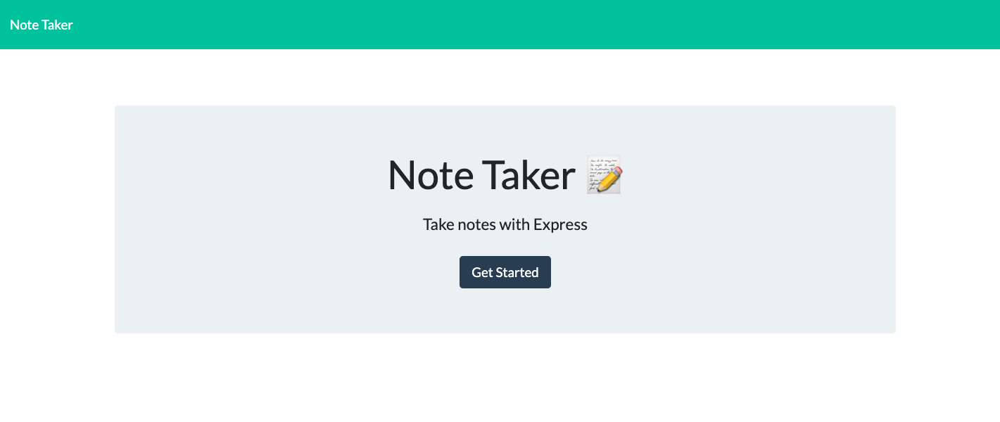
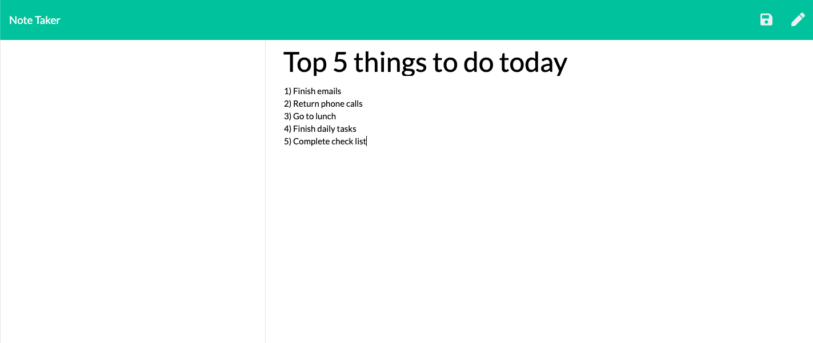
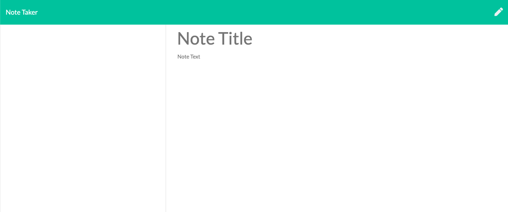

# note_taker
This page allows users to write notes, which are stored into a json file. Each note is assigned an id and the notes stay even when the page is refreshed or left.

## Installation

No installation is necessary

## Purpose

The purpose of this project is to give a is to create a functional back end connection between a json object at imput by a user. This allows users to save notes which populate a json file, allowing the user to refresh or leave the page and return at another time 

## Functionaality

This page displays notes left by users through populating db.json file. The information is then populated back to the webpage allowing the user to recall it, add new notes, or delete them. 

## Contributing

Other students and TA's 

Pull requests are welcome. However, for major chages, please open an issue first to discuss what you would like to change.

Please make sure to update tests as appropriate

## Links

Page URL: https://dry-lake-48846.herokuapp.com/

Github Repo: https://github.com/cmarshman/note_taker

## Images

Favicon +++++++++++++++++++++++++++++++++++++++++++++++++

Page Opening +++++++++++++++++++++++++++++++++++++++++++

Notes Page +++++++++++++++++++++++++++++++++++++++++++++

Stored Notes +++++++++++++++++++++++++++++++++++++++++++

Deleted Notes ++++++++++++++++++++++++++++++++++++++++++

## License
MIT License

Copyright (c) [2020] [Cory_Marshman]

Permission is hereby granted, free of charge, to any person obtaining a copy of this software and associated documentation files (the "Software"),to deal in the Software without restriction, including without limitation the rights to use, copy, modify, merge, publish, distribute, sublicense, and/or sell copies of the Software, and to permit persons to whom the Software is furnished to do so, subject to the following conditions: The above copyright notice and this permission notice shall be included in all copies or substantial portions of the Software.

THE SOFTWARE IS PROVIDED "AS IS", WITHOUT WARRANTY OF ANY KIND, EXPRESS OR IMPLIED, INCLUDING BUT NOT LIMITED TO THE WARRANTIES OF MERCHANTABILITY, FITNESS FOR A PARTICULAR PURPOSE AND NONINFRINGEMENT. IN NO EVENT SHALL THE AUTHORS OR COPYRIGHT HOLDERS BE LIABLE FOR ANY CLAIM, DAMAGES OR OTHER LIABILITY, WHETHER IN AN ACTION OF CONTRACT, TORT OR OTHERWISE, ARISING FROM, OUT OF OR IN CONNECTION WITH THE SOFTWARE OR THE USE OR OTHER DEALINGS IN THE SOFTWARE.